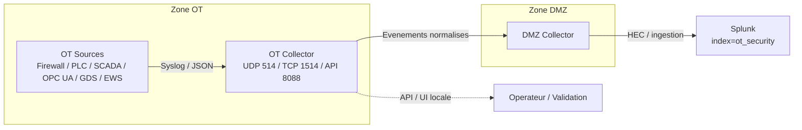

# OT Collector - Gestion des donnees OT

## 1. Introduction

Dans l architecture LabShock/DataProtect, l OT Collector est le premier point de collecte et de normalisation situe dans la zone OT. Son role est de recevoir les flux syslog et les evenements applicatifs locaux, de les transformer en evenements SIEM coherents, puis de les stocker et de les relayer de facon controlee vers le DMZ Collector avant toute exposition a Splunk.

Le placement dans la zone OT est volontaire. Il permet de conserver les donnees brutes au plus pres des assets industriels, de reduire les dependances reseau inter-zones, et de garantir une trace locale meme en cas de rupture du lien vers le DMZ. Les assets OT ne doivent pas envoyer directement vers Splunk car cela creerait une sortie reseau non maitrisee depuis l OT, rendrait la collecte plus fragile, et supprimerait le point de controle de normalisation, filtrage, deduplication et priorisation des evenements.

## 2. Position dans l architecture

Le chemin valide est le suivant :

OT assets -> OT Collector -> DMZ Collector -> Splunk index=ot_security

Le collecteur expose aussi une API locale et une interface web pour l observation, la validation et la maintenance.



## 3. Mecanismes d entree

L OT Collector accepte plusieurs mecanismes d entree.

| Mecanisme | Port / endpoint | Usage |
|---|---:|---|
| Syslog UDP | 514 | Flux principal pour les sources OT et les forwarders locaux. Convient aux evenements simples, a faible latence, et aux emetteurs qui n ont pas besoin d accuse de reception. |
| Syslog TCP | 1514 | Flux alternatif pour les sources qui prefèrent une liaison orientee connexion ou lorsqu il faut une meilleure robustesse de transport. |
| HTTP / API events | `POST /events` et `POST /test-event` | Injection d evenements normalises ou de payloads bruts pour tests, replay et validation. |
| API / UI locale | 8088 | Console locale pour la consultation des evenements, des statistiques, des sources, des regles et du forwarding. |

Les flux syslog sont utilises pour la telemetrie en provenance des assets OT. Les endpoints HTTP servent surtout a la validation, au test d ingestion, au replay et a la maintenance. L interface web est une couche de visibilite locale et ne remplace pas l ingestion syslog.

## 4. Pipeline d ingestion des evenements

Le pipeline d ingestion est le suivant :

1. Le listener UDP ou TCP recoit une ligne brute.
2. La ligne est parsee en message syslog. Le collecteur comprend les formats RFC3164-like, RFC5424-like, ISO syslog et les messages bruts.
3. Si un JSON structure est present dans le message, il est extrait et traite comme telemetrie structuree.
4. La source est identifiee a partir de l IP, du hostname, de l app_name et du contenu.
5. Une normalisation specifique a la source est appliquee depuis les references Markdown de `logs by sources/`.
6. L evenement est enrichi avec les metadonnees de SIEM et les tags de normalisation.
7. Le moteur de filtrage calcule la decision de collecte, d echantillonnage ou de rejet.
8. L evenement retenu est ecrit localement dans `/data/events.jsonl`.
9. Si le forwarding est actif, l evenement est transmis vers le DMZ Collector.
10. L API et l UI locales exposent les donnees normalisees pour la supervision et la validation.

Le collecteur conserve toujours la preuve brute afin de permettre le re-parsing, l investigation et l audit.

## 5. Schema d evenement normalise

Schema logique principal :

| Champ | Description |
|---|---|
| `id` | Identifiant unique de l evenement. |
| `timestamp` | Horodatage metier ou horodatage extrait du message. |
| `received_at` | Horodatage de reception par le collecteur. |
| `zone` | Zone de securite, ici `OT`. |
| `source_type` | Type logique de source, par exemple `firewall`, `plc`, `scada`, `opcua`, `gds_agent`, `ews`. |
| `asset_name` | Nom humain de l asset. |
| `asset_ip` | Adresse IP de l asset ou de la source. |
| `severity` | Niveau de severite normalise. |
| `protocol` | Protocole logique ou famille de provenance. |
| `event_category` | Famille fonctionnelle de l evenement. |
| `message` | Type canonique d evenement. |
| `raw` | Ligne brute ou payload brut conserve pour preuve. |
| `tags.*` | Metadonnees de routage, normalisation, ingestion et SIEM. |

Exemple JSON :

```json
{
  "id": "2f0f0e7d9f0d4f6d9f3d1f0c0a1b2c3d",
  "timestamp": "2026-05-17T15:43:04.000Z",
  "received_at": "2026-05-17T15:43:04.120Z",
  "zone": "OT",
  "source_type": "scada",
  "asset_name": "FUXA SCADA",
  "asset_ip": "192.168.1.60",
  "severity": "info",
  "protocol": "syslog",
  "event_category": "data_collection",
  "message": "scada_plc_connection_attempt",
  "raw": "2026-05-17T15:43:04.000Z [info] 'RAIL AUTO' try to connect 192.168.1.23",
  "tags": {
    "normalized": "true",
    "normalization_source": "logs_by_sources_md",
    "parser_version": "v2.logs_by_sources_md",
    "splunk_sourcetype": "labshock:ot:scada",
    "siem_index_hint": "ot_security",
    "collector_decision": "store_and_forward",
    "collector_decision_hint": "store_forward",
    "forwarding_status": "queued",
    "matched_rule_id": "",
    "risk_level": "LOW",
    "target": "RAIL AUTO",
    "target_ip": "192.168.1.23",
    "original_message": "2026-05-17T15:43:04.000Z [info] 'RAIL AUTO' try to connect 192.168.1.23"
  }
}
```

## 6. Normalisation pilotee par les sources

La normalisation est pilotee par les fichiers Markdown de `logs by sources/`, qui servent de reference fonctionnelle pour la classification, la severite, les champs importants, la priorite de tableau de bord et les candidats a l alerte. Le collecteur n invente pas de type d evenement : il applique uniquement les mappings documentes et les heuristiques deja valides.

| source_type | asset_name | sourcetype attendu | evenements cles | readiness dashboard |
|---|---|---|---|---|
| `firewall` | `OPNsense OT Firewall` | `labshock:net:firewall` | `firewall_pass`, `firewall_block` | Bonne. Les flux pass/block et les champs reseau sont exploitables. |
| `plc` | `PLC1` a `PLC5` | `labshock:ot:plc` | `plc_login_attempt`, `plc_login_success`, `plc_user_logout`, `plc_started`, `plc_stopped` | Bonne. Les evenements de login et de cycle de vie sont stabilises. |
| `scada` | `FUXA SCADA` | `labshock:ot:scada` | `scada_plc_connection_attempt`, `scada_plc_read_memory_error`, `scada_plc_connected`, `scada_polling_overload`, `scada_script_load_error`, `scada_user_created`, `scada_settings_updated`, `scada_runtime_restart`, `scada_opcua_connection_break`, `scada_opcua_certificate_san_mismatch` | Bonne, avec un ajustement de bruit encore possible sur les logs de demarrage. |
| `opcua` | `OPC UA Server` | `labshock:ot:opcua` | `modbus_connection_failed`, `modbus_connection_recovered`, `certificate_verified`, `session_activated`, `unauthorized_write`, `sensitive_write_accepted`, `opcua_write_rejected` | Bonne pour la sante OPC UA / Modbus et la securite des ecritures. |
| `gds_agent` | `OT GDS Agent` | `labshock:ot:gds` | `certificate_expiry_critical`, `certificate_inventory_drift_detected`, `gds_cert_missing_runtime`, `trustlist_diff_detected`, `sync_cycle_success`, `sync_cycle_failure` | Bonne, avec affinage possible du bruit de synchronisation. |
| `ews` | `Engineering Workstation` | `labshock:ot:ews` | `ews_heartbeat`, `project_file_modified`, `plc_project_modified`, `scada_project_modified`, `suspicious_file_change`, `private_key_access_attempt_or_skip` | Partielle a bonne selon le volume de heartbeat et de changements de fichiers. |

## 7. Regles de parsing et d enrichissement

Le collecteur applique les regles suivantes :

- **Normalisation de severite** : `warn` et `WAR` deviennent `warning`, `err` et `ERR` deviennent `error`, `info` reste `info`, `critical` reste `critical`.
- **Normalisation de category** : les categories sont alignees avec le type metier de l evenement, par exemple `data_collection`, `access_control`, `system_health`, `security`, `pki_validation`, `pki_trust_sync`.
- **Canonicalisation du message** : le champ `message` est transforme en type canonique, par exemple `firewall_block`, `plc_login_attempt`, `scada_plc_connection_attempt`.
- **Preservation du brut** : la ligne brute ou le payload original reste dans `raw` pour l audit et l investigation.
- **Stabilite de l identite source** : `source_type`, `asset_name` et `asset_ip` restent coherents apres normalisation.
- **Assignation du sourcetype Splunk** : `tags.splunk_sourcetype` est force selon la source.
- **Versioning du parseur** : `tags.parser_version=v2.logs_by_sources_md` permet de tracer la logique de normalisation utilisee.
- **Preservation du message initial** : si le message est remappe, `tags.original_message` conserve la forme nettoyee initiale.
- **Tag de provenance de normalisation** : `tags.normalized=true` et `tags.normalization_source=logs_by_sources_md` indiquent que l evenement a passe la couche source-driven.

## 8. Logique de filtrage et de forwarding

Le moteur de filtrage produit une decision qui pilote la suite du pipeline.

| Tag / concept | Role |
|---|---|
| `collector_decision` | Resume de la decision finale : `drop`, `sample`, `store_only`, `store_and_forward`, `forward_only`. |
| `collector_decision_hint` | Indication rapide du comportement attendu : `store_forward`, `store_only`, `forward_only`, `sample_or_drop`. |
| `matched_rule_id` | Identifiant de la regle ayant declenche la decision, s il y en a une. |
| `forwarding_status` | Etat de forwarding, par exemple `queued` lorsque l evenement est en attente d emission. |

Le pipeline peut conserver localement sans forwarding, stocker et forwarder, ou echantillonner / rejeter selon les regles, la severite et les mecanismes de deduplication. La deduplication et l echantillonnage s appliquent pour proteger le collecteur et limiter le bruit, mais les evenements critiques sont prioritaires.

## 9. Protection des evenements a forte valeur

Ces evenements ne doivent jamais etre elimines par erreur par la logique de filtre ou de bruit :

- `firewall_block`
- `plc_login_attempt`
- `plc_login_success`
- `plc_stopped`
- `scada_opcua_connection_break`
- `scada_script_load_error`
- `scada_user_created`
- `scada_settings_updated`
- `modbus_connection_failed`
- `unauthorized_write`
- `sensitive_write_accepted`
- `certificate_expiry_critical`
- `gds_cert_missing_runtime`
- `private_key_access_attempt_or_skip`
- `suspicious_file_change`

Cette politique garantit que les signaux a forte valeur de securite et de disponibilite restent visibles meme en presence de filtrage ou de deduplication.

## 10. Stockage local

Le fichier `/data/events.jsonl` est la source locale de reference pour les evenements retenus. Chaque ligne contient un objet JSON complet.

Pourquoi ce stockage local est important en OT :

- il limite la perte de preuve en cas d indisponibilite du DMZ ou du SIEM,
- il permet un buffering simple et robuste,
- il facilite la relecture et la revalidation de la normalisation,
- il conserve une trace exploitable pour l investigation locale et les audits.

Dans un contexte OT, le stockage local est un element de resilence et de traçabilite, pas seulement un mecanisme de cache.

## 11. Role de l API / UI locale

L API et l UI locale servent a la supervision de proximite :

- visualisation des evenements recents,
- verification de la sante des sources,
- controle du filtrage et des regles,
- revue des evenements normalises,
- validation du forwarding,
- diagnostic de la couverture de collecte.

Cette interface est utile pour confirmer rapidement qu une source est ingeree, que la normalisation est correcte et que les tags de SIEM sont bien presentes avant l envoi vers le DMZ.

## 12. Commandes de validation locale

Exemples de controles utiles sur une instance de validation :

```bash
# Verifier que les listeners sont actifs
ss -lntup | grep -E ':514|:1514|:8088'
```

```bash
# Verifier la route / la reachability vers le DMZ ou les assets de test
ip route
ping -c 3 192.168.1.70
```

```bash
# Verifier le fichier JSONL local
tail -n 20 /data/events.jsonl
```

```bash
# Injecter un event UDP de test
echo "<14>May 17 15:43:04 localhost SCADA[29]: 2026-05-17T15:43:04.000Z [info] 'PLC1' try to connect 192.168.1.20" | nc -u -w1 127.0.0.1 514
```

```bash
# Verifier les evenements normalises par source
jq -c 'select(.source_type=="scada") | {source_type,asset_name,message,event_category,severity,splunk_sourcetype:.tags.splunk_sourcetype}' /data/events.jsonl | tail -n 20
```

```bash
# Verifier la couverture de parser_version
jq -r '.tags.parser_version // "missing"' /data/events.jsonl | sort | uniq -c
```

## 13. SPL de validation Splunk

Les requetes ci-dessous valident la normalisation et la couverture des sources.

### Tous les evenements par source_type

```spl
index=ot_security
| stats count by source_type asset_name event_category severity message
| sort - count
```

### Evenements non normalises

```spl
index=ot_security
| where isnull(source_type) OR isnull(asset_name) OR isnull(severity) OR isnull(event_category) OR isnull(message)
| table _time asset_name source_type severity event_category message raw
```

### Evenements sans sourcetype

```spl
index=ot_security
| where isnull(sourcetype) OR sourcetype=""
| table _time asset_name source_type sourcetype message raw
```

### Candidats alertes

```spl
index=ot_security tags.alert_candidate=true
| table _time asset_name source_type severity event_category message tags.* raw
| sort - _time
```

### Dernier evenement par source

```spl
index=ot_security
| stats latest(_time) as last_seen latest(message) as last_message latest(severity) as last_severity by source_type asset_name
| sort asset_name
```

### Couverture de version du parseur

```spl
index=ot_security
| stats count by tags.parser_version source_type asset_name
| sort - count
```

## 14. Limites connues / backlog

Les points ci-dessous restent a affiner ou a confirmer. Ils sont marques **A valider** lorsque la priorisation ou le comportement final peut encore evoluer.

- **A valider** : seuil de repetition pour les erreurs SCADA `scada_plc_read_memory_error` et eventuel marquage `alert_candidate=true` au-dela d un seuil.
- **A valider** : validation finale du client FUXA GDS si un flux distinct est encore en cours d integration dans une autre branche ou un autre depot.
- **A valider** : tuning du bruit pour les heartbeats et logs de startup SCADA / EWS.
- **A valider** : refinement des tableaux de bord apres baselining operationnel.

## 15. Conclusion

L OT Collector est le point de normalisation et de controle cote OT avant le passage vers le DMZ. Il stabilise les donnees issues des sources industrielles, preserve la preuve brute, applique les regles de filtrage et de forwarding, et garantit que les evenements critiques restent visibles pour le SIEM. Dans l architecture LabShock/DataProtect, il constitue la couche OT-side indispensable entre les assets industriels et Splunk.